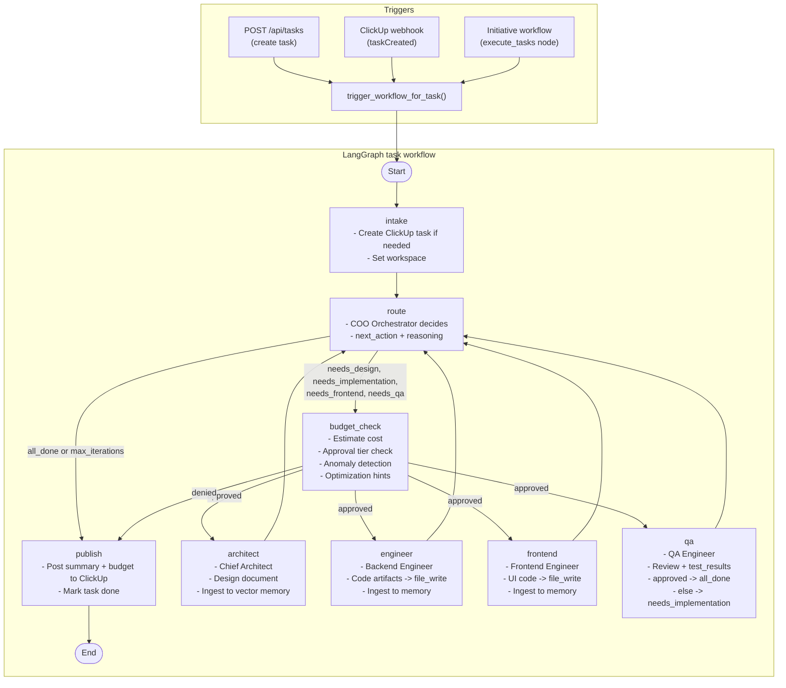
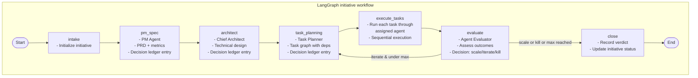
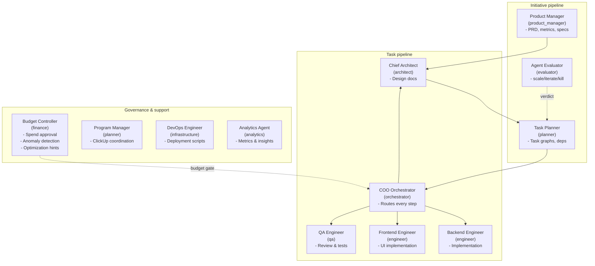
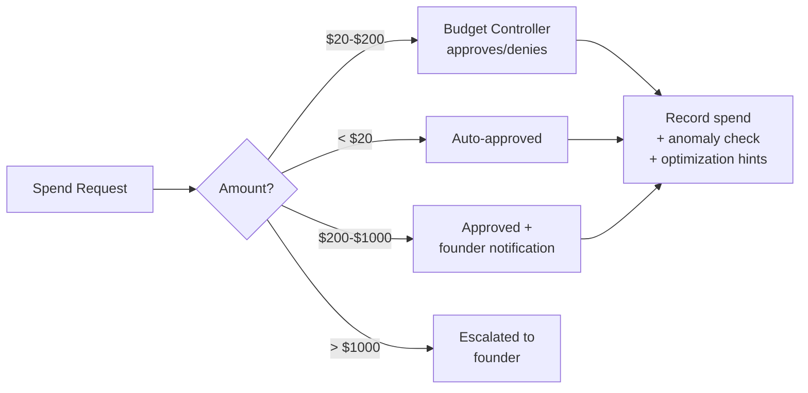
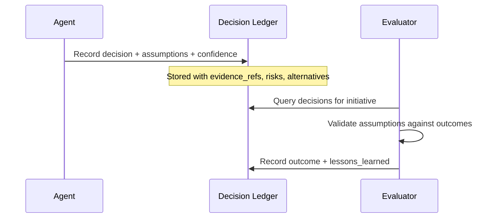
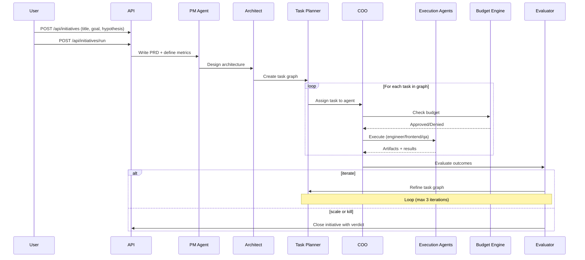

# AECO — Working Process & Company Structure

## 1. Task-level workflow

How a single task moves from trigger to done:

**Flow in short:**
Trigger (API, ClickUp webhook, or initiative workflow) -> **intake** -> **route** (COO decides) -> **budget_check** (approved -> agent, denied -> publish) -> one of **architect / engineer / frontend / qa** -> back to **route** (loop until `all_done` or `max_iterations`) -> **publish** -> end.

---

## 2. Initiative-level workflow

How a product initiative flows from idea to verdict:

**Flow in short:**
`POST /api/initiatives/run` -> **intake** -> **pm_spec** (PRD + metrics) -> **architect** (design) -> **task_planning** (task graph) -> **execute_tasks** (run agents) -> **evaluate** (scale/iterate/kill) -> loop back to task_planning if iterating, else **close**.

---

## 3. Company structure (agents & roles)

All 12 agents and their status:

**Roles:**

| Role             | In workflow     | Agents |
|------------------|-----------------|--------|
| Product Manager  | Initiative      | PM Agent |
| Task Planner     | Initiative      | Task Planner |
| Evaluator        | Initiative      | Agent Evaluator |
| Orchestrator     | Task            | COO Orchestrator |
| Architect        | Both            | Chief Architect |
| Engineer         | Task            | Backend Engineer, Frontend Engineer |
| QA               | Task            | QA Engineer |
| Finance          | Task (gate)     | Budget Controller |
| Planner          | Available       | Program Manager |
| Infrastructure   | Available       | DevOps Engineer |
| Analytics        | Available       | Analytics Agent |

---

## 4. Budget approval flow

---

## 5. Decision Ledger flow

Every major decision gets recorded with explicit assumptions:

---

## 6. End-to-end process (initiative level)

---

*Generated from the AECO codebase. 12 agents, 2 workflow graphs (task + initiative), budget engine, decision ledger.*
